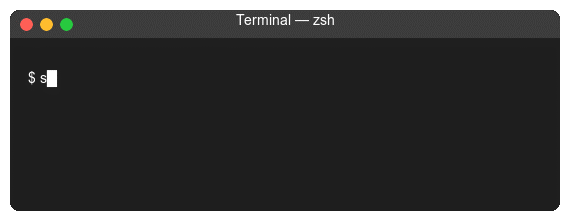
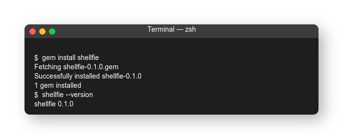
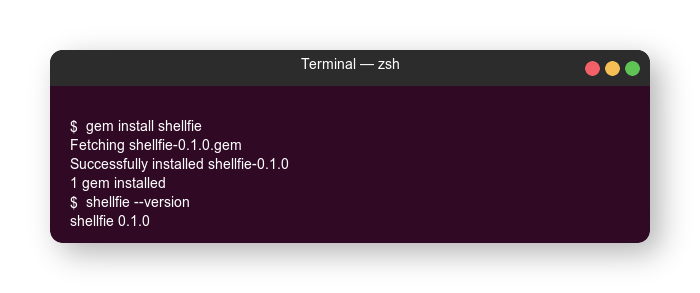
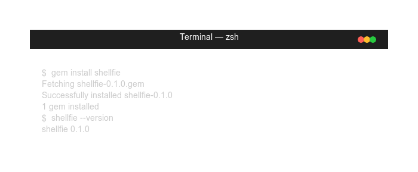
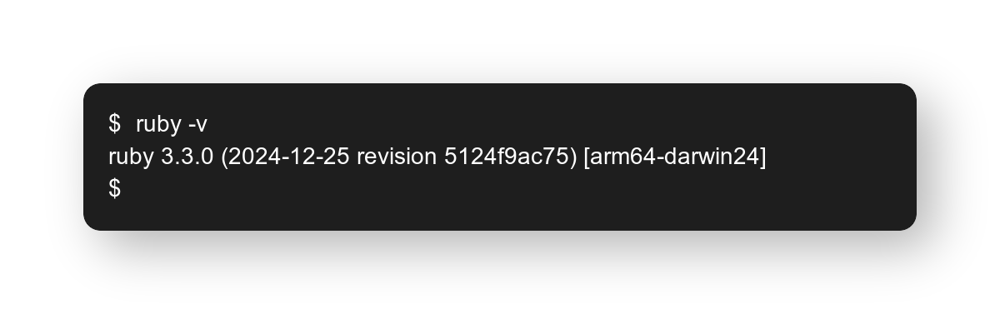

<p align="center">
  
  <p align="center">
    <strong>Generate beautiful terminal screenshots from YAML</strong>
  </p>
  <p align="center">
    <a href="https://rubygems.org/gems/shellfie"></a>
    <a href="https://rubygems.org/gems/shellfie"></a>
    
    
  </p>
</p>

<p align="center">
  <a href="#features">Features</a> •
  <a href="#installation">Installation</a> •
  <a href="#usage">Usage</a> •
  <a href="#configuration">Configuration</a> •
  <a href="#themes">Themes</a>
</p>

---

**Shellfie** (Shell + Selfie) creates stunning terminal screenshot-style images from simple YAML configuration files. Perfect for documentation, README files, tutorials, and presentations — without actually taking screenshots.

<p align="center">
  
</p>

## Features

### Multiple Themes

Generate images with different terminal styles:

<table>
  <tr>
    <th>macOS</th>
    <th>Ubuntu</th>
    <th>Windows</th>
  </tr>
  <tr>
    <td></td>
    <td></td>
    <td></td>
  </tr>
</table>

### Animated GIFs

Create typing animations with realistic effects:

```yaml
animation:
  typing_speed: 50    # Milliseconds per character
  command_delay: 500  # Pause after command
  loop: true          # Loop animation
```

### Full ANSI Color Support

- Standard 8 colors + bright variants
- 256-color palette
- True color (24-bit RGB)
- Bold, italic, underline styles

### Flexible Output Options

- **High DPI support** — Generate 2x or 3x scaled images for Retina displays
- **Headless mode** — Output without window decorations
- **Shadow effects** — Beautiful drop shadows
- **Transparent backgrounds** — Perfect for overlays
- **Fixed height with scrolling** — Consistent GIF dimensions

## Installation

### Requirements

- Ruby 3.0+
- ImageMagick 7.0+

```bash
# Install ImageMagick first
brew install imagemagick      # macOS
sudo apt install imagemagick  # Ubuntu/Debian
choco install imagemagick     # Windows
```

### Install the gem

```bash
gem install shellfie
```

Or add to your Gemfile:

```ruby
gem 'shellfie'
```

## Usage

### Quick Start

1. Create a configuration file:

```yaml
# terminal.yml
theme: macos
title: "Terminal — zsh"

window:
  width: 600
  padding: 20

lines:
  - prompt: "$ "
    command: "echo 'Hello, World!'"
  - output: "Hello, World!"
```

2. Generate an image:

```bash
shellfie generate terminal.yml -o output.png
```

### Commands

| Command | Description |
|---------|-------------|
| `shellfie generate <file> -o <output>` | Generate image from config |
| `shellfie init` | Output sample configuration |
| `shellfie themes` | List available themes |
| `shellfie validate <file>` | Validate configuration |
| `shellfie version` | Show version |
| `shellfie help` | Show help |

> [!TIP]
> Use `shf` as a shorter alias for `shellfie`

### Generate Options

```bash
shellfie generate config.yml -o output.png [options]
```

| Option | Description |
|--------|-------------|
| `-o, --output PATH` | Output file path (required) |
| `-t, --theme NAME` | Override theme (`macos`, `ubuntu`, `windows`) |
| `-a, --animate` | Generate animated GIF |
| `-s, --scale FACTOR` | Output scale (1, 2, 3) for HiDPI |
| `-w, --width PIXELS` | Override width |
| `--no-shadow` | Disable shadow effect |
| `--no-header` | Disable window header (headless mode) |
| `--transparent` | Transparent background |

### Examples

```bash
# Basic PNG
shellfie generate config.yml -o terminal.png

# Animated GIF
shellfie generate config.yml -o demo.gif --animate

# Retina-ready (2x scale)
shellfie generate config.yml -o terminal@2x.png --scale 2

# Headless (no window decorations)
shellfie generate config.yml -o code.png --no-header

# Ubuntu theme with custom width
shellfie generate config.yml -o ubuntu.png -t ubuntu -w 800
```

## Configuration

### Basic Structure

```yaml
theme: macos              # Theme: macos, ubuntu, windows
title: "Terminal — zsh"   # Window title
headless: false           # Hide window decorations

window:
  width: 600              # Window width in pixels
  padding: 20             # Content padding
  visible_lines: 10       # Fixed line count (for scrolling GIFs)

font:
  family: "Monaco"        # Font family
  size: 14                # Font size
  line_height: 1.4        # Line height multiplier

lines:                    # Static content
  - prompt: "$ "
    command: "echo hello"
  - output: "hello"
```

### Static Images

```yaml
theme: macos
title: "Terminal"

lines:
  - prompt: "$ "
    command: "gem install shellfie"

  - output: |
      Fetching shellfie-0.1.0.gem
      Successfully installed shellfie-0.1.0
      1 gem installed

  - prompt: "$ "
    command: ""
```

### Animated GIFs

```yaml
theme: macos
title: "Demo"

animation:
  typing_speed: 50      # ms per character
  command_delay: 500    # ms after command execution
  cursor_blink: true    # Show blinking cursor
  loop: true            # Loop the animation

frames:
  - prompt: "$ "
    type: "echo 'Hello!'"   # Text to type (animated)
    delay: 500              # Pause after this frame

  - output: "Hello!"
    delay: 1000
```

### ANSI Colors

```yaml
lines:
  - prompt: "\e[32muser@host\e[0m:\e[34m~/project\e[0m$ "
    command: "ls"

  - output: "\e[34mdir1\e[0m  \e[32mfile.txt\e[0m  \e[31merror.log\e[0m"
```

**Supported escape codes:**

| Code | Effect |
|------|--------|
| `\e[0m` | Reset |
| `\e[1m` | Bold |
| `\e[3m` | Italic |
| `\e[4m` | Underline |
| `\e[30-37m` | Foreground colors |
| `\e[40-47m` | Background colors |
| `\e[90-97m` | Bright foreground |
| `\e[38;5;Nm` | 256-color foreground |
| `\e[38;2;R;G;Bm` | RGB foreground |

### Fixed Height with Scrolling

For GIFs with many lines, use `visible_lines` to maintain consistent dimensions:

```yaml
window:
  width: 600
  visible_lines: 8    # Show only last 8 lines

frames:
  - prompt: "$ "
    type: "for i in {1..20}; do echo $i; done"
  # Lines will scroll as content exceeds visible_lines
```

## Themes

### macOS (default)

Classic macOS Terminal appearance with traffic light buttons (red, yellow, green) on the left side.

### Ubuntu

GNOME Terminal style with window controls on the right side and Ubuntu's signature purple background.

### Windows Terminal

Modern Windows Terminal design with flat styling and square corners.

### Headless Mode

No window decorations — just the terminal content. Perfect for embedding in documentation.

<p align="center">
  
</p>

```bash
shellfie generate config.yml -o output.png --no-header
```

Or in YAML:

```yaml
headless: true
```

## Development

```bash
git clone https://github.com/yourusername/shellfie.git
cd shellfie

bundle install
bundle exec rspec      # Run tests
```

## Contributing

1. Fork it
2. Create your feature branch (`git checkout -b feature/amazing-feature`)
3. Commit your changes (`git commit -am 'Add amazing feature'`)
4. Push to the branch (`git push origin feature/amazing-feature`)
5. Open a Pull Request

## License

Released under the [MIT License](LICENSE).
