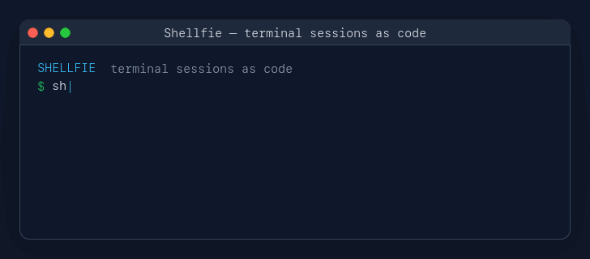

# shellfie

Generate terminal screenshot-style images and animations from YAML.

<p align="center">
  
</p>

<p align="center">
  <a href="https://rubygems.org/gems/shellfie"></a>
  <a href="https://rubygems.org/gems/shellfie"></a>
  
  
</p>

<p align="center">
  
</p>

## Install

Requirements:

- Ruby 3.0+
- ImageMagick 7+

```bash
brew install imagemagick
gem install shellfie
```

For Bundler:

```ruby
gem "shellfie"
```

## Quick Start

Create `terminal.yml`:

```yaml
version: 1
theme: macos
title: "Terminal - zsh"

window:
  width: 600
  padding: 20

lines:
  - prompt: "$ "
    command: "echo hello"
  - output: "hello"
```

Generate an image:

```bash
shellfie generate terminal.yml -o terminal.png
# Without -o, Shellfie writes terminal.png beside terminal.yml.
```

Use `shf` as a short alias for `shellfie`.

## CLI

```bash
shellfie generate config.yml -o output.png
shellfie generate config.yml -o demo.gif --animate
shellfie generate config.yml -o output.svg --format svg
shellfie generate config.yml -o output.png --scale 2 --no-shadow
shellfie generate config.yml -o output.png --no-header
shellfie validate config.yml
shellfie themes
shellfie init
```

Execute a real terminal session only when requested, save a cassette, and replay it offline:

```bash
shellfie run examples/session.yml -o session.svg
shellfie record examples/session.yml -o session.mp4 --cassette session.json
shellfie record examples/session.yml -o session.svg --yaml editable-recording.yml
shellfie replay session.json -o session.gif --animate
```

Version 2 session files support `requires`, `run`, `type`, `key`, `sleep`, live-screen/line/prompt/exit/stable-screen `wait`, `expect`, `hide`, `show`, named `capture`, redaction patterns, reusable `include` scenarios, and multiple `outputs`. A `run` step may set `cwd`; terminal settings can restrict `env_allowlist`, set `cwd_policy: root` to reject working directories outside the session file's directory (including symlink escapes), and set `total_timeout`; `expect.golden`, `expect.line`, and elapsed bounds provide text assertions. Set `async: true` on `run` or `key: enter` before interacting with a long-running or full-screen process, then use `wait` to synchronize. An output can select an intermediate screen with `capture: NAME`. `run` uses Ruby's PTY support and is optional; normal `generate` remains deterministic and never executes config content. Cassette replay does not execute the recorded commands; `record --yaml` also writes an editable version 1 animation.

Session `vars` use `{{name}}` placeholders. A placeholder used as the whole value preserves scalar types; embedded placeholders are converted to text. Shell `$VAR` and `${VAR}` syntax is left untouched.

Authoring commands:

```bash
shellfie new terminal.yml --template static       # static, animation, run, tui, ci, theme-gallery
shellfie format terminal.yml
shellfie compile terminal.yml --format json
shellfie schema 1                                 # use 2 for run sessions
shellfie completion zsh
shellfie completion powershell
shellfie watch terminal.yml -o terminal.png
shellfie validate terminal.yml --format sarif       # text, json, sarif, junit
```

JSON Schemas live in [`schema/`](schema/). Add `# yaml-language-server: $schema=../schema/shellfie-v1.schema.json` to a compose file for editor validation. Use `--manifest manifest.json` during generation to record config/output hashes, Ruby, OS, ImageMagick, ffmpeg, and resolved font fingerprints.

Set `window.ambiguous_width` to `1` (default) or `2` for terminals that render East Asian Ambiguous characters as double-width. `inspect` and reproducibility manifests report the Ruby Unicode version, Shellfie width-table version, and selected policy.

OSC controls are ignored by default. Set `window.osc_policy: preserve` to keep `http`, `https`, and `mailto` OSC 8 links in SVG/HTML; unsafe schemes, control characters, and URLs over 2048 bytes are discarded.
SIXEL, Kitty, and iTerm2 image controls are discarded by default. Set `window.graphics_policy: error` to fail instead of silently omitting terminal graphics.

Set `animation.direction` to `forward`, `reverse`, or `ping_pong`. `animation.loop_offset` rotates that playback order by a zero-based rendered-frame index, which is useful for choosing the initial thumbnail.

The repository also provides a Docker image definition and a Docker-based GitHub Action:

```yaml
- uses: ydah/shellfie@main
  with:
    input: examples/simple.yml
    output: docs/terminal.png
    check: "true"
```

Version tags are release-gated: `vX.Y.Z` must match `Shellfie::VERSION`. A successful tagged build runs the full suite, attests and uploads the gem, and creates the matching GitHub Release.

Common `generate` options:

| Option | Description |
| --- | --- |
| `-o, --output PATH` | Output path/template with `{name}`, `{theme}`, `{scale}`, `{format}`; defaults beside input |
| `--preset NAME` | Exact `readme`, `ogp`, `widescreen` (16:9), `standard` (4:3), or `vertical` canvas |
| `-t, --theme NAME` | Override theme |
| `-a, --animate` | Render animation |
| `-s, --scale FACTOR` | Output scale: `1`, `2`, or `3` |
| `-w, --width PIXELS` | Override window width |
| `--format FORMAT` | `png`, `gif`, `svg`, `svg-raster`, `webp`, `apng`, `mp4`, `webm`, `png-sequence`, `html`, `txt`, `ansi`, `json`, or `asciicast` |
| `--check` | Exit unsuccessfully when the existing output is stale; do not replace it |
| `--jobs N` | Render up to 32 inputs in parallel after all targets pass preflight |
| `--typing-rate CPS` | Override typing rate in characters per second |
| `--framerate FPS` | Set output timing precision |
| `--seed N` | Set the deterministic animation jitter seed |
| `--playback-speed FACTOR` | Speed up or slow down the final timeline |
| `--overflow MODE` | `clip`, `wrap`, or `scroll` |
| `--no-shadow` | Disable shadow |
| `--transparent` | Transparent background |
| `--no-header` | Headless output |
| `--force` | Overwrite existing files |

Static output supports `png`, native selectable-text `svg`, accessible standalone `html`, legacy `svg-raster`, and `webp`.
Animated output supports `gif`, `webp`, `apng`, `mp4`, `webm`, and event-duration `png-sequence` directories with a `timeline.json` manifest (`ffmpeg` is required for video). Semantic transcripts support plain `txt`, ANSI-preserving `ansi`, structured `json`, and asciinema v2 `asciicast`/`cast`.

## Configuration

Static content uses `lines`:

```yaml
theme: macos
title: "Terminal"

window:
  width: 600
  padding: 20
  visible_lines: 8
  overflow: clip

font:
  family: Monaco
  size: 14
  line_height: 1.4

lines:
  - prompt: "$ "
    command: "gem install shellfie"
  - output: |
      Successfully installed shellfie
      1 gem installed
```

Animations use `frames`:

```yaml
theme: macos
title: "Demo"

animation:
  typing_speed: 50
  framerate: 30
  playback_speed: 1.0
  command_delay: 500
  cursor_blink: true
  loop: true
  palette: global
  dither: true
  gif_colors: 256
  gif_optimize: true
  webp_lossless: true
  webp_quality: 100
  webp_method: 4
  webp_near_lossless: 100
  apng_prediction: paeth
  loop_count: 0
  scroll_easing: ease_out

frames:
  - prompt: "$ "
    type: "echo hello"
    delay: 500
  - output: "hello"
    delay: 1000
```

`delay` is the post-action delay for that frame. On a `type` frame it overrides `animation.command_delay`.
When both `lines` and `frames` are present, `lines` form the initial screen before animation events run.

Useful top-level keys:

| Key | Purpose |
| --- | --- |
| `theme` | `macos`, `ubuntu`, `windows`, or `custom` |
| `color_scheme` | Built-in color scheme such as `dracula` |
| `colors` | Theme color overrides |
| `window` | Size, padding, wrapping, clipping, scrolling |
| `font` | Font family, size, line height |
| `animation` | Typing speed, delays, loop, palette, easing |
| `cursor` | Cursor style and color |
| `headless` | Hide window chrome |
| `lines` | Static terminal content |
| `frames` | Animated terminal content |

ANSI SGR colors and common styles are supported in `prompt`, `command`, and `output`, including 8-color, bright, 256-color, and RGB escape sequences. Common carriage-return, erase, and horizontal cursor controls are also supported; this is intentionally not a full terminal emulator.

Configs may include other YAML files relative to their own location with `include: path.yml`. Set `include_policy: root` to reject includes that resolve outside the root config directory. Include cycles and files larger than 1 MiB are rejected with a diagnostic chain. Resource ceilings can be set under `limits`; image pixels, animation work, temporary bytes, source frames, lines, and characters are checked before expensive work.

## Themes

Built-in window themes:

- `macos`
- `ubuntu`
- `windows`

Headless output removes window chrome:

```yaml
headless: true
```

or:

```bash
shellfie generate config.yml -o output.png --no-header
```

## Development

```bash
bundle install
bundle exec rspec
```

## License

[MIT](LICENSE)
